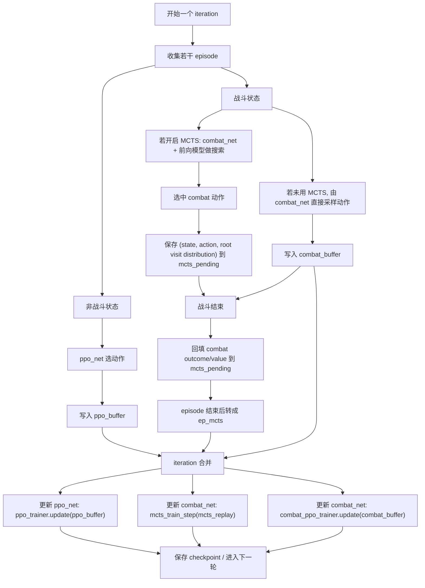

# MCTS 正式训练接入说明

## 结论

`train_hybrid.py` 已经是正式训练入口，不需要再分叉出单独的 MCTS 训练主脚本。

这次接入做了两件事：

1. 补了正式配置 [hybrid_train_ironclad_teacher_main_attention_mcts.toml](/C:/Users/Administrator/Desktop/sts2Raw2/STS2AI/Python/configs/hybrid_train_ironclad_teacher_main_attention_mcts.toml:1)，默认在 live combat 中开启 MCTS 搜索。
2. 修了 [train_hybrid.py](/C:/Users/Administrator/Desktop/sts2Raw2/STS2AI/Python/train_hybrid.py:1164) 里 `mcts_warmup_iters` 之前未生效的问题。现在当 `iteration < mcts_warmup_iters` 时，combat 会走随机动作热身，不会提前做 MCTS 搜索或 MCTS 回放训练。

## 正式入口

推荐直接用脚本：

```powershell
.\STS2AI\Python\scripts\start-hybrid-training-mcts.ps1
```

它等价于：

```powershell
python STS2AI/Python/train_hybrid.py `
  --config STS2AI/Python/configs/hybrid_train_ironclad_teacher_main_attention_mcts.toml
```

## 快速 smoke

如果只是确认链路已经接通，可以先跑一轮短 smoke：

```powershell
python STS2AI/Python/train_hybrid.py `
  --config STS2AI/Python/configs/hybrid_train_ironclad_teacher_main_attention_mcts.toml `
  --num-envs 1 `
  --max-iterations 1 `
  --episodes-per-iter 1 `
  --mcts-sims 16 `
  --mcts-batch-size 8 `
  --mcts-train-steps 1 `
  --save-interval 1 `
  --no-save-replay-traces `
  --output-dir STS2AI/Artifacts/hybrid_training_main_attention_mcts_smoke
```

重点看 `metrics.jsonl` 里的这些字段：

- `new_mcts`
- `mcts_replay`
- `mcts_ploss`
- `combat_random_warmup_steps`

预期：

- 正式 MCTS 训练配置里 `mcts_warmup_iters = 0`，所以 `combat_random_warmup_steps` 应该是 `0`
- 只要本轮发生 combat，`new_mcts` 和 `mcts_replay` 应该大于 `0`
- 当 `mcts_batch_size` 达标时，`mcts_ploss` 应该非零

## 使用建议

- 从主线 checkpoint 恢复时，默认把 `mcts_warmup_iters` 设为 `0` 更合适，因为 combat 头不是冷启动。
- 如果后续改成从更弱的 combat 初始化恢复，可以临时加 `--mcts-warmup-iters 20` 或 `50`，先让 combat 走随机热身，再打开搜索。
- 想先验证收益，再拉长训练时长时，优先做 A/B：
  - baseline: `hybrid_train_ironclad_teacher_main_attention.toml`
  - MCTS: `hybrid_train_ironclad_teacher_main_attention_mcts.toml`


